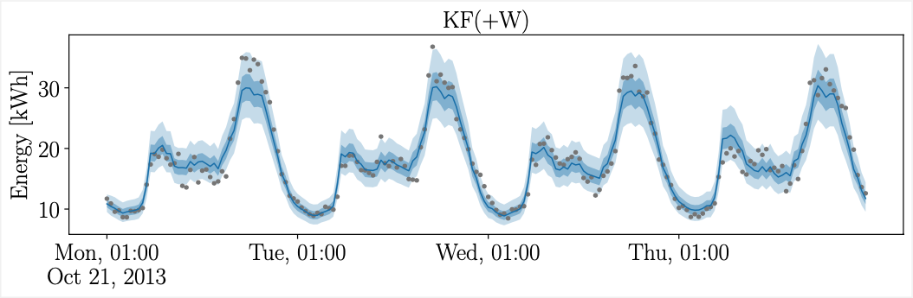
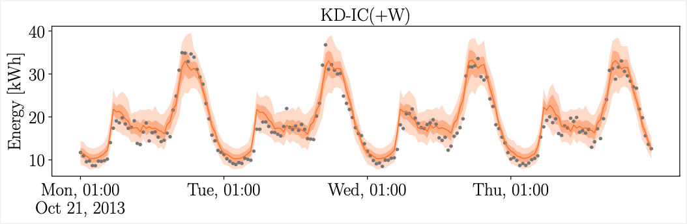
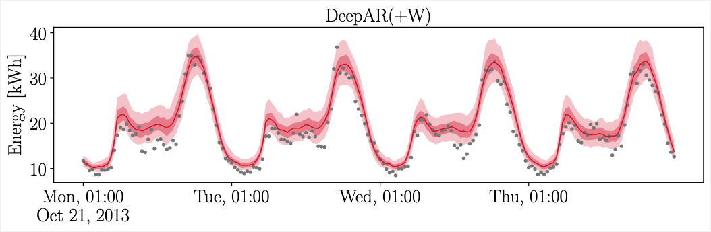

# Probabilistic forecasting of smart meter time series

This repository contains the python code for my master thesis with the title: "Hierarchical probabilistic forecasting of smart meter time series using weather input". 

### Table of contents

- [Abstract](#abstract)
- [Probabilistic forecasting examples](#probabilistic-forecasting-examples)
- [How to use](#how-to-use)
- [Project structure](#project-structure)
- [References](#references)

## Abstract

The operation of sustainable energy systems requires accurate probabilistic forecasts of electricity demand on various hierarchy levels in the energy system — ranging from individual households to cities and entire countries. Weather variables, such as temperature and dew point, are strongly correlated with electricity demand on higher levels in the hierarchy (e.g. city level) but seem to have little effect on lower levels (e.g. household level). Therefore, in this thesis, we investigate at which point in the hierarchy — constructed of 2500 individual smart meter time series from London households — weather input is beneficial to four day ahead forecasts of electricity demand. More specifically, we separately analyze the influence of actual weather data and weather forecasts. To that end, we implement three probabilistic forecasting models from the literature and, if necessary, adjust the models to optionally utilize weather data. The first model is based on double seasonal Holt-Winters-Taylor Exponential Smoothing [[6]](#6), it computes forecasts with the Kalman Filter [[5]](#5) in closed form and can include weather variables through mean adjustments. The second model, called KD-IC [[1]](#1), uses Kernel Density Estimation to create non-parametric density forecasts and can be conditioned on temperature through a kernel [[2]](#2). The third model is an autoregressive Recurrent Neural Network (DeepAR [[4]](#4)) that optionally takes weather variables as network input and generates probabilistic forecasts by recursively computing sample paths. Our results indicate that actual weather data improves the forecasting performance of the Kalman Filter and DeepAR models on most hierarchy levels. In particular, our evaluation shows a strong correlation, of the score difference between the models without weather input and with actual weather input, and the number of aggregated smart meters. Nevertheless, weather forecast input rarely leads to competitive forecasting performance and is in many cases even detrimental to the electricity forecast.

## Probabilistic forecasting examples

The following figures contain four day ahead forecasts by the Kalman Filter (KF), KD-IC and DeepAR model with weather input (W) for a time series consisting of 56 aggregated smart meters. The gray points are the actual observations, the solid line denotes the median forecast and the areas around the line denote the 50% and 90% confidence intervals.







## How to use

The code in this repository is written for our own preprocessed version of the smart meter data from London households [[3]](#3). Therefore, this repository does not provide ready-to-use generic code for probabilistic energy forecasting. It is rather meant as supplementary material to my master thesis. 

However, if you want to reuse the models or evaluation scripts for your own project, the minimal requirements for executing scripts are listed in `requirements.txt`. Everything is written in Python 3.7.9.

## Project structure

```bash
.
├── distributions  # Provides code for the probability distribution used by the forecasting models
│   ├── distribution.py  # Abstract superclass
│   ├── empirical.py  # Empirical (sampled) distribution
│   ├── log_normal.py  # Log-normal distribution
│   └── non_parametric.py  # Non-paramtric distribution, evaluated on a grid
├── eval # Provides scripts for the analysis of the data and evaluation of the forecasting model
│   ├── data_analysis.py
│   └── evaluation.py
├── forecast_examples  # Example forecast plots (see above)
│   ├── DeepAR_W.png
│   ├── KD-IC_W.png
│   └── KalmanFilter_W.png
├── main.py  # Main script that reads the data, fits the models and computes forecasts
├── models  # Contains the different forecasting models
│   ├── deep_ar.py  # DeepAR
│   ├── forecast_model.py  # Abstract superclass for the probabilistic forecasting models
│   ├── kalman_filter.py  # HWT Exponential smoothing and the Kalman Filter
│   ├── kd_ic.py  # KD-IC
│   ├── last_week.py  # Naive last week benchmark
│   └── log_normal_ic.py  # Log-normal-IC (a parametric variant of KD-IC)
└── utils.py  # Utility functions
```

## References

<a id="1">[1]</a> Arora, S. and Taylor, J. W. (2016). “Forecasting electricity smart meter data using conditional kernel density estimation”. In: Omega 59, pp. 47–59.

<a id="2">[2]</a> Haben, S. and Giasemidis, G. (2016). “A hybrid model of kernel density estimation and quantile regression for GEFCom2014 probabilistic load forecasting”. In: International Journal of Forecasting 32.3, pp. 1017–1022.

<a id="3">[3]</a> Kaggle (2019). Smart meters in London. url: https://www.kaggle.com/jeanmidev/smart-meters-in-london (visited on 04/30/2021).

<a id="4">[4]</a> Salinas, D., Flunkert, V., Gasthaus, J., and Januschowski, T. (2020). “DeepAR: Probabilistic forecasting with autoregressive recurrent networks”. In: International Journal of Forecasting 36.3, pp. 1181–1191.

<a id="5">[5]</a> Särkkä, S. (2013). Bayesian filtering and smoothing. Cambridge University Press.

<a id="6">[6]</a> Taylor, J. W. (2010). “Exponentially weighted methods for forecasting intraday time series with multiple seasonal cycles”. In: International Journal of Forecasting 26.4, pp. 627–646.
